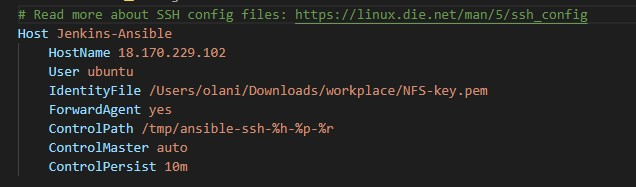
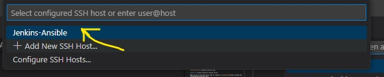

# ANSIBLE CONFIGURATION MANAGEMENT

**AIM OF THIS PROJECT:**

*The aim of this project is to automate routine tasks and appreciate DevOps tools by using Ansible Configuration Management to set up virtual servers, install and configure software, and deploy a web application. The project also focuses on writing code using YAML declarative language. The project introduces the concept of a Jump Server, also known as a Bastion Host, as an intermediary server to provide access to the internal network, where the web servers are located within a secured network that cannot be reached directly from the internet. The project divides the Virtual Private Network (VPC) into two subnets, a Public subnet with public IP addresses and a Private subnet that is only reachable by private IP addresses.*

**Architecture of the Solution**


**Step 1:** Install Ansible on Jenkins server

Make you use of the same server used for jenkins in [workplace-9](https://github.com/olaniyi2oguns/workplace-9.git).

`sudo apt update`

`sudo apt install -y ansible`

check the version of your ansible with `sudo ansible --version`


**Step 2:** Building a new job in jenkins

Create a new repository for this project on your [github](https://github.com) and name it "**Ansible-config-mgt**".

Create a new Freestyle job "**Ansible**" in Jenkins and connect it to your "ansible-config-mgt" repository.

Configure webhook in your "ansible-config-mgt" repository to trigger a new build in your Ansible job in Jenkins. Check [workplace-9](https://github.com/olaniyi2oguns/workplace-9.git) to learn how to configure your webhook.

On your Ansible job in Jenkins, configure a Post-build job to save all (**) files. Check [workplace-9](https://github.com/olaniyi2oguns/workplace-9.git).

From a remote client in which your "**Ansible-config-mgt**" has been cloned, make some changes to your README.MD file in main branch and commit it to your git repository. Then, check your "**Ansible**" job on Jenkins to see if a new build has been triggered automatically. 
On your jenkins server, check the artifacts to see if the changes you made is saved with command

`ls /var/lib/jenkins/jobs/ansible/builds/<build_number>/archive/` 

**NOTE:** Trigger Jenkins build only from main branch on your repo.

As soon as you successfully connect your Ansible job on you jenkins server, your solution will looks like the image below:


**Step 3:** Prepare your development environment using Visual Studio Code

To write some codes as a DevOps Engineer, you need tools such as the [Integrated developemt Environment (IDE)](https://en.wikipedia.org/wiki/Integrated_development_environment) or [source-code Editor](https://en.wikipedia.org/wiki/Source-code_editor) so that you can easily create a development environment that could easily be connected to your repository. 

For this project, I will recommend [Visual Studio Code (VSC)](https://en.wikipedia.org/wiki/Visual_Studio_Code) and you can get it [Here](https://code.visualstudio.com/download). However, you are free to use any other source-code Editor of your choice. 

After installation of VSC is done, configure it to connect to your git repository. [You can watch this video](https://www.youtube.com/watch?v=mR9jhYD3bnI&pp=ygUzaG93IHRvIGluc3RhbGwgYW5kIGNvbm5lY3QgdnNjIHRvIGdpdGh1YiByZXBvc2l0b3J5) to learn more on how to install and connect VSC to github repository. 

Clone your Ansible-config-mgt to your VSC using your terminal by running the command 

`git clone <ansible-config-mgt repository link>`. See image below for guide on how to get your repository link.


**Step 4:** Ansible Development

After your git repository has been brought down to your local machine through VSC, create a new branch called "ANS-1" or you can give it any unique name of your choice by running command 

`git checkout -b <name of branch>`

To confirm that you are now in the console of the new branch you created, look at the left hand bottom corner of your VSC and you will find the name of the branch you are using


You can as well run command `git status` to know the branch you are in


In the new branch you created, create the following directories:

Playbooks 

Inventory.

Inside playbooks directory, create a playbook file called "common.yaml"

Within inventory directory, create file for Development, staging, testing, and production environment as dev.yaml, staging.yaml, uat.yaml, and prod.yaml respectively

**Step 5:** Setting up an Ansible inventory

On your vsc, cd into your inventory and open the dev.yaml file. Paste in the 

```
[nfs]
<NFS-Server-Private-IP-Address> ansible_ssh_user='ec2-user'

[webservers]
<Web-Server1-Private-IP-Address> ansible_ssh_user='ec2-user'
<Web-Server2-Private-IP-Address> ansible_ssh_user='ec2-user'

[db]
<Database-Private-IP-Address> ansible_ssh_user='ubuntu' 

[lb]
<Load-Balancer-Private-IP-Address> ansible_ssh_user='ubuntu'
```
NOTE: *An Ansible inventory file defines the hosts and groups of hosts upon which commands, modules, and tasks in a playbook operate. Since our intention is to execute Linux commands on remote hosts, and ensure that it is the intended configuration on a particular server that occurs. It is important to have a way to organize our hosts in such an Inventory.*


**Step 6:** Create a common playbook

Open your common.yaml file in your playbook to create your first play that will give ansible instruction on what needs to be performed on all servers mentioned in the inventory/dev.yaml file. Update the common.yaml file with the code below:

```
---
- name: update web, nfs and db servers
  hosts: webservers, nfs, db
  remote_user: ec2-user
  become: yes
  become_user: root
  tasks:
    - name: ensure wireshark is at the latest version
      yum:
        name: wireshark
        state: latest

- name: update LB server
  hosts: lb
  remote_user: ubuntu
  become: yes
  become_user: root
  tasks:
    - name: Update apt repo
      apt: 
        update_cache: yes

    - name: ensure wireshark is at the latest version
      apt:
        name: wireshark
        state: latest
```

You can learn more on Ansible playbooks in this [video](https://youtu.be/ZAdJ7CdN7DY) and this [article](https://www.redhat.com/en/topics/automation/what-is-an-ansible-playbook)

**Step 7:** Update GIT with latest code

Now that you have written your first play, and your inventory is ready, it is necessary to merge your changes to the main branch as your playbook is still on the branch repository on git. To do this, first confirm the branch you are working on by running command `git status`. Once you have confirmed that you are actually working on the Ansible-jenkins branch, run the following commands:

`git add .`

`git commit -m "<give any suitable description>"`

`git push`

Login to github and locate the repository you are working on. click on compare and pull request to review what you have done. NOTE: In real time, this could be the work of another engineer, it is called "peer review"


If you are okay with all code, click on "create pull request"


Then, merge the code to the main branch.

Go back to your vsc terminal and change to main branch by running command 

`git checkout main` and check the `git status` to ensure that you are in the main branch.

Pull your merged code to your repo by running command `git pull`


**Step 8:** Connecting your vsc to your Ansible-jenkins instance

On your gitbash terminal or the likes of it, cd to the directory that contains your Ansible-jenkins instance and the other servers instance keypair (if you used the same key.pair for all the server). Run the following commands

```
eval `ssh-agent -s`
```
`ssh-add <path-to-private-key>`

For example, if you save your instance key pair in your Downloads and the keypair name is ansible-jenkins.pem, then cd to Downloads on your terminal and run the first command and then the second command as:

`ssh-add ansible-jenkins.pem`

NOTE: if you used different keypair for the different servers you will have to run the second command for each of the path of the keypairs.

confirm that your has been successfully added by running command `ssh-add -l` and you should see the name of your keypair. Note: VSC terminal may not allow you to run these commands. 

Now, ssh into your Jenkins-Ansible server with this command:

`ssh -A ubuntu@<your-server-public-ip-address>`

Once you are connected, ssh to other servers from your jenkins-ansible server to confirm that you can connect with them remotely. For example, for web server on RHEL, `ssh ec2-user@<ip-address-of-webserver>` and you will get result like the one in the image below:


Before you continue, open your jenkins to see the latest build in your Ansible job. Then, can confirm also on your terminal by running command:

`ls /var/lib/jenkins/jobs/<name-of-your-ansible-job>/builds/<build-number>/archive`

**Step 9:** Running your first Ansible playbook
On your vsc, ensure that you have installed "remove development" extension and then click its sign at the left hand bottom corner of the vsc


Click on connect to host


click on configure ssh host


Enter the codes in the image below into the configuration file



click on remote development sign again and select the host you want to connect to



if you are successful you should see the new of the server you have connected to


NOTE: if you are getting error, check yourconfiguration very well and try again. Should your configuration is okay and you are still getting error, click on try again like until your finally connected. 


Now you can run your ansible playbook with command:

`ansible-playbook - i /var/lib/jenkins/jobs/<name-of-job>/builds/<build-number>/archive/inventory/dev.yaml /var/lib/jenkins/jobs/<name-of-job>/builds/<build-number>/archive/common.yaml`

If your configuration is okay you should have the type of output in the image below:


You can go to each of the servers and check if wireshark has been installed by running `which wireshark` or `wireshark --version`

If the service is successfully installed through your ansible, you should have the result in the image below:


Our new architecture should looks like this:


**CONGRATULATIONS**

You have just automated your routine tasks by implementing your first Ansible project! 

Continue to visit my repo for more exiting projects!

